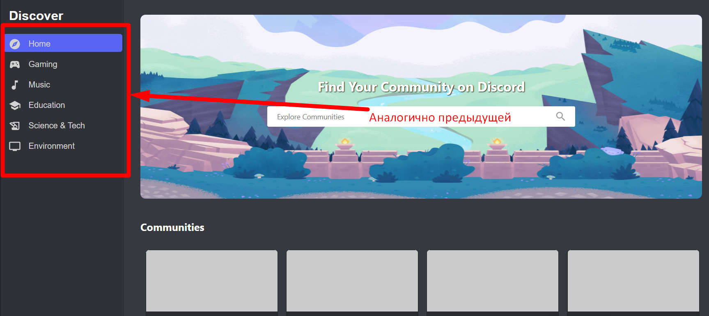

В этом проекто я использовал следующий стек технологий:

- React js для структуры и базового функционала
- Scss и Bootstrap 5 для верстки и стилистического оформления

Все фидимы книпки являются активными и выпоняют базовый функционал перенаправляют на другие окна, открывают всплывающие
и тп по их прямому назначению, дальше чем одно действие вперед вункционал не расписывал

